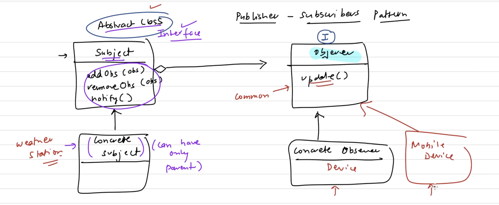

# Observer Pattern

## What is it?

The Observer Pattern is a way to let many objects get notified when one object changes.

Think of it like a **YouTube channel**. You subscribe once. Every time the channel uploads a new video, YouTube notifies you automatically. You don't have to keep checking. The channel doesn't need to know your name or contact — it just sends the update to everyone subscribed.

- The **channel** = Subject (also called Publisher)
- The **subscribers** = Observers

---

## The Problem


Look at the code in `problem/without_observer_pattern.dart`.

We have a `WeatherStation` that measures temperature. We also have a `DisplayDevice` (like a screen) that shows that temperature.

```dart
class WeatherStation {
  DisplayDevice? displayDevice; // tightly tied to one specific class

  void notifyDevice() {
    displayDevice?.showTemp(temparature); // only knows about DisplayDevice
  }
}
```

**What goes wrong?**

| Problem | Why it hurts |
|---|---|
| `WeatherStation` directly holds a `DisplayDevice` | They are tightly coupled — hard to change one without touching the other |
| Want to add a `TVDevice`? | You must open `WeatherStation` and change its code |
| Want to add 10 more devices? | You write 10 new lines manually inside `WeatherStation` |

This breaks the **Open/Closed Principle**: your code should be open to adding new things, but closed to changing existing working code.


**OOP Problem:** `WeatherStation` is tightly coupled to `DisplayDevice` — it directly holds and calls a specific class, making it hard to swap or extend without touching existing code.

 **SOLID Problem (OCP):** Adding a new device (like a `TVDevice`) forces you to open and modify `WeatherStation`, violating the Open/Closed Principle — classes should be open for extension, closed for modification.

 **SOLID Problem (DIP):** `WeatherStation` depends on a concrete class (`DisplayDevice`) instead of an abstraction, violating the Dependency Inversion Principle.

---

## The Solution

Look at the code in `solution/ovserver_pattern.dart`.

The fix is to use two interfaces: `Subject` and `Observer`.

```
Subject (interface)          Observer (interface)
- attach(obs)                - update(temp)
- detach(obs)
- notifyObservers()
```

`WeatherStation` implements `Subject`. Every device (DisplayDevice, MobileDevice) implements `Observer`.

Now `WeatherStation` only knows about the `Observer` interface — not any specific device. It just loops through a list and calls `update()` on everyone.

```dart
void notifyObservers() {
  for (final obs in _observerList) {
    obs.update(_temperature); // works for ANY observer
  }
}
```



---

## How the Code Works (Step by Step)

```dart
// 1. Create the subject (publisher)
WeatherStation weatherStation = WeatherStation();

// 2. Create observers (subscribers)
DisplayDevice device = DisplayDevice("SamsungLCD");
MobileDevice mobileDevice = MobileDevice();

// 3. Subscribe them
weatherStation.attach(device);
weatherStation.attach(mobileDevice);

// 4. Change temperature -> both get notified automatically
weatherStation.setTemperature(25);
// Output:
// Temperature on SamsungLCD device is 25.0
// Temperature on Mobile is 25.0

// 5. Unsubscribe mobile
weatherStation.detach(mobileDevice);

weatherStation.setTemperature(26);
// Output:
// Temperature on SamsungLCD device is 26.0  (mobile no longer notified)
```

When you call `setTemperature()`, it updates the value and immediately calls `notifyObservers()`. That method loops through `_observerList` and calls `update()` on each one. This is **runtime polymorphism** — each device responds in its own way.

---

## Before vs After

| | Without Pattern | With Observer Pattern |
|---|---|---|
| Adding a new device | Must change `WeatherStation` | Just create a new class, attach it |
| `WeatherStation` knows about | Every specific device class | Only the `Observer` interface |
| Removing a device | Must edit `WeatherStation` | Call `detach()` — nothing else changes |
| Scalability | Gets messy quickly | Scales cleanly |

---

## Key Roles in This Pattern

| Role | In this example | What it does |
|---|---|---|
| **Subject** | `WeatherStation` | Holds the list of observers, notifies them on change |
| **Observer** | `DisplayDevice`, `MobileDevice` | Receives updates via `update()` |
| **attach()** | `weatherStation.attach(device)` | Subscribe a new observer |
| **detach()** | `weatherStation.detach(mobileDevice)` | Unsubscribe an observer |
| **notifyObservers()** | Called inside `setTemperature()` | Loops and calls `update()` on all observers |

---

## Real-World Examples

- **YouTube / Social Media** — You subscribe to a channel. You get notified when they post.
- **Stock Market Apps** — A stock price changes. All investors watching that stock get an alert.
- **News Apps** — A news article is published. All subscribers get a notification.
- **UI Button Clicks** — A button is the subject. Click listeners (observers) respond to it.
- **Logging Systems** — An event happens. Multiple log handlers write it to console, file, and server.

---

## Summary

The Observer Pattern solves one specific problem: **how do you notify many objects when something changes, without hardcoding who those objects are?**

The answer: make the subject hold a list of observers. Anyone can subscribe or unsubscribe at any time. The subject never needs to know the details of who is listening — it just calls `update()` on everyone.

This keeps your code **loosely coupled**, **scalable**, and **easy to extend**.
