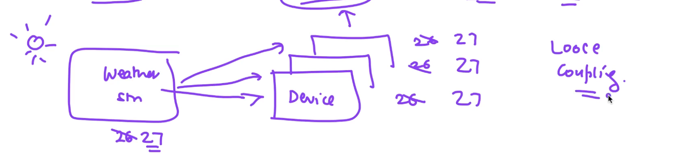

# The Problem (Why do we need the Observer Pattern?)

Imagine you have a **Weather Station**. It tracks the temperature.
You also have a **Phone App** and a **TV Screen**. They both need to show the temperature.

### The Bad Way (Without Observer Pattern)

Without the Observer Pattern, the Weather Station has to know about every device.
When the temperature changes, the Weather Station directly tells the Phone App and the TV Screen.

This means the Weather Station is **tightly tied** (tightly coupled) to the Phone and the TV.

### The Problem with Extension

What does "extension" mean? It means adding new things to your program without breaking old things.

Let's say you buy a new **Smart Watch**. You want the Smart Watch to also show the temperature. 
To add this new feature (extension), you have to do the following in the bad way:

1. Open the code for the **Weather Station**.
2. Add the new **Smart Watch** inside the Weather Station code.
3. Write new code so the Weather Station can update the Smart Watch.

**Why is this bad?**

* **Hard to Add New Things:** Every time you want to add a brand new device, you MUST change the Weather Station code.
* **Breaks the Rules:** In good coding, we follow the **Open/Closed Principle**. This rule says: "Your program should be easy to extend (add new things), but you should not have to change existing core code to do it." 
* **Risky:** If you keep changing the main Weather Station code to add new devices, you might break the Weather Station by accident.

### Summary

If we don't use the Observer Pattern, adding new features (extension) is very hard. You have to open and modify old code just to add something new. 

We need a better way. We need a way to add new devices easily, without ever touching the Weather Station code again. The **Observer Pattern** solves this exact problem!